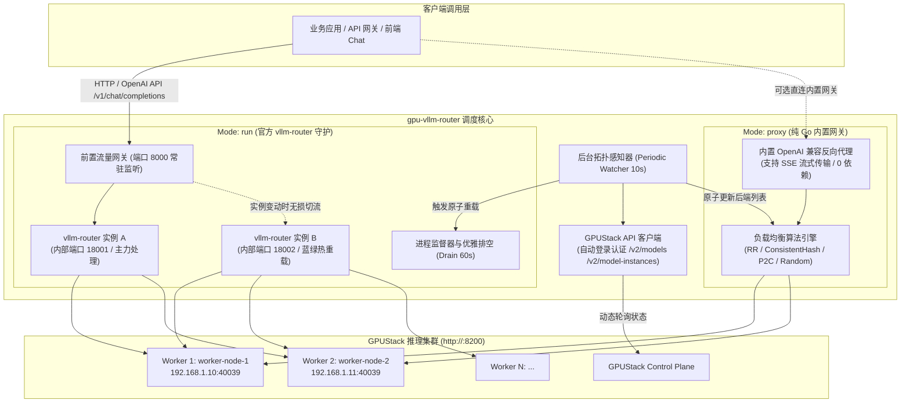
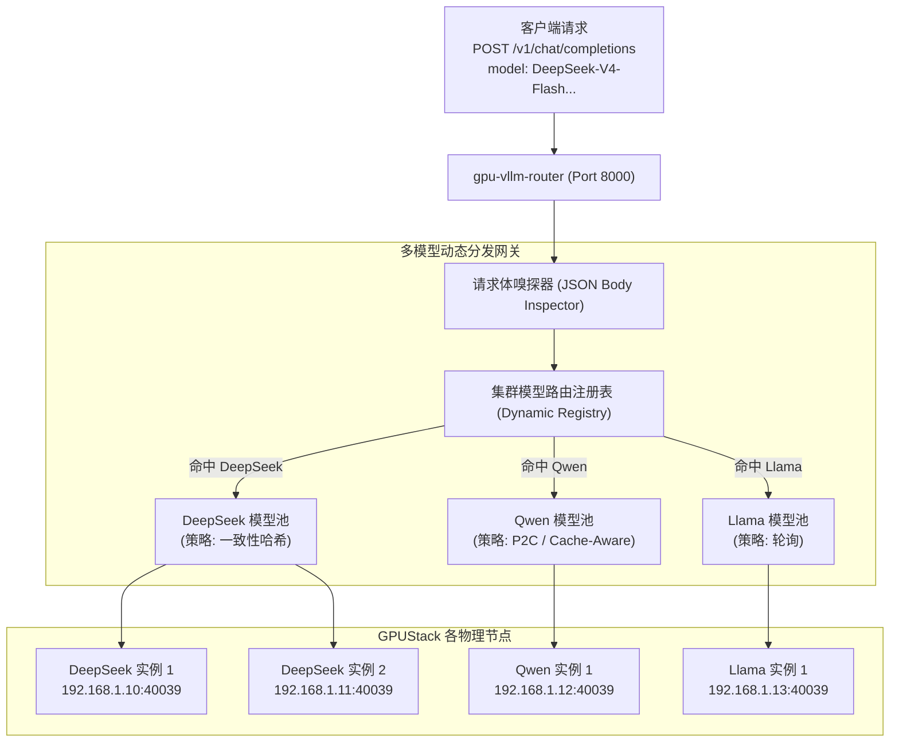

# GPUStack 与 vLLM-Router 动态实例调度与网关工具 (`gpu-vllm-router-cli`)

[](https://golang.org)
[](LICENSE)
[](https://github.com/vllm-project/router)
[](https://github.com/gpustack/gpustack)

`gpu-vllm-router-cli` 是一个专为 **[GPUStack](https://github.com/gpustack/gpustack)** AI 集群与 **[vLLM-Router](https://github.com/vllm-project/router)**（vLLM 官方高性能请求路由器）打造的纯 Go 命令行工具与轻量后端桥接系统。

本项目为**零前端依赖的纯后端 CLI 版本**（不含 Node.js / React 前端页面，无多余构建负担，体积小巧、编译极速），核心聚焦于：
1. **生成后端启动指令 (`-mode cmd`)**：一键发现 GPUStack 实例并生成官方 vLLM-Router 的标准 Bash、PowerShell、Docker 启动指令。
2. **内置纯 Go 高可用网关 (`-mode proxy`)**：零外部依赖，直接作为兼容 OpenAI API 的反向代理网关。
3. **官方路由器守护与热重载 (`-mode run`)**：双进程蓝绿零停机滚动热重载。
4. **运维监控 API**：提供 `/api/topology`、`/api/config`、`/metrics` 与 OpenAPI 文档接口。

---

## 目录

- [一、核心架构与系统拓扑](#一核心架构与系统拓扑)
- [二、主要功能特性](#二主要功能特性)
- [三、六大负载均衡策略详解](#三六大负载均衡策略详解)
- [四、快速上手指南](#四快速上手指南)
  - [1. 列出集群模型](#1-列出集群模型)
  - [2. 模式一：生成启动命令 (`-mode cmd`)](#2-模式一生成启动命令--mode-cmd)
  - [3. 模式二：内置 Go 高可用网关 (`-mode proxy` 全集群多模型负载)](#3-模式二内置-go-高可用网关--mode-proxy-全集群多模型负载)
  - [4. 模式三：官方路由器守护与零停机重载 (`-mode run`)](#4-模式三官方路由器守护与零停机重载--mode-run)
- [五、全集群多模型动态路由机制](#五全集群多模型动态路由机制)
- [六、零停机热重载（Zero-Downtime）原理解析](#六零停机热重载zero-downtime原理解析)
- [七、熔断器（Circuit Breaker）与透明故障转移（Failover Retry）](#七熔断器circuit-breaker与透明故障转移failover-retry)
- [八、命令行参数与环境变量全集](#八命令行参数与环境变量全集)
- [九、配置文件使用 (`config.yaml`)](#九配置文件使用-configyaml)
- [十、管理与监控接口](#十管理与监控接口)
- [十一、生产部署与运维建议](#十一生产部署与运维建议)
- [十二、编译与测试](#十二编译与测试)
- [十三、Docker 与 Docker-Compose 容器化部署](#十三docker-与-docker-compose-容器化部署)

---

## 一、核心架构与系统拓扑



---

## 二、主要功能特性

1. **全集群多模型自动纳管与智能路由（无需指定模型名）**
   - 支持一键同步 GPUStack 集群上的**全部模型**及其对应运行实例，自动构建多模型路由表。
   - 对外统一暴露 OpenAI 兼容网关，请求到达时自动解析请求体中的 `"model"` 参数，分发至对应模型的负载均衡池。
   - 自动聚合全集群就绪模型的 `GET /v1/models` 列表，与各大前端/框架（如 NextChat, OpenWebUI, LangChain）完美对接。

2. **自动服务发现与健康过滤**
   - 支持全集群自动发现，亦支持通过 `-model` 指定单个模型进行过滤。
   - 自动过滤实例运行状态，仅提取处于 `running` 状态的活跃节点。
   - 智能解析对外广播地址（`worker_advertise_address`）与物理 IP（`worker_ip`），自动绑定分配的服务端口。

3. **支持官方全部 6 种负载均衡策略**
   - 覆盖一致性哈希、Prefix-Caching 缓存感知、轮询、P2C、随机分发等算法，兼顾高并发吞吐与大模型 KV-Cache 上下文命中率。
   - 多模型模式下，各个模型拥有**完全独立的负载均衡器**，互不干扰。

4. **双重保障运行形态**
   - **支持官方 Rust 二进制**：完整兼容 `vllm-project/router` 官方参数体系，支持多节点数据并行度设置。
   - **支持零依赖纯 Go 网关**：本地未安装 Rust/Cargo 也能立即运行，原生支持全集群多模型智能路由、毫秒级流式转发与状态管理。

5. **真正的零停机无损热重载（Zero-Downtime Rolling Reload）**
   - 业务对外端口常驻监听，永不关闭，杜绝重载期间的 `Connection Refused`。
   - 蓝绿双进程无感切换，提供长连接优雅排空期（Graceful Drain），确保流式对话不被强制掐断。

---

## 三、六大负载均衡策略详解

可以通过命令行随时查看受支持的策略：
```powershell
.\gpu-vllm-router.exe -list-policies
```

| 策略标识 (`-policy`) | 中文名称 | 会话亲和性 | 负载感知 | 适用业务场景与核心收益 |
| :--- | :--- | :---: | :---: | :--- |
| **`consistent_hash`**<br>*(推荐默认)* | **一致性哈希** | **是** | 否 | **多轮对话系统、智能客服、Agent 场景**。<br>根据会话标识将同一用户的连续交互精准路由到同一 Worker 节点，最大化复用 **KV Cache**，显著降低首字延迟（TTFT）。 |
| **`cache_aware`** | **前缀缓存感知** | **是** (Cache) | **是** | **企业知识库（RAG）、公用长 Prompt 场景**。<br>根据 Prompt 共享前缀深度优化缓存重用，兼顾各 Worker 的负载倾斜度。 |
| **`round_robin`** | **平滑轮询** | 否 | 否 | **单轮问答、基准评测、无状态请求**。<br>在各健康节点间严格均等交替分发流量。 |
| **`power_of_two`**<br>*(P2C)* | **两选一负载均衡** | 否 | **是** | **请求耗时差异悬殊、长短文本混杂场景**。<br>每次随机抽取两个 Worker，优先分发给当前活跃在途连接数（Active Connections）较少的节点，避免单点过载。 |
| **`random`** | **均匀随机** | 否 | 否 | **超大节点集群、简单微服务部署**。<br>纯随机轮换，分发开销极低。 |
| **`rendezvous_hash`** | **最高随机权重哈希** | **是** | 否 | **节点频繁动态增删集群**。<br>相比一致性哈希在节点下线时数据迁移更加平滑均匀。 |

### 会话保持 Key 优先级（针对 `consistent_hash`）
为了让多轮对话命中同一个实例，工具支持按以下优先级自动提取会话指纹：
1. HTTP 请求头：`X-Session-ID`（推荐，性能最高）
2. HTTP 请求头：`X-User-ID`
3. HTTP 请求头：`X-Tenant-ID`
4. HTTP 请求头：`X-Request-ID`
5. 请求 Body JSON 字段：`session_params.session_id`
6. 请求 Body JSON 字段：`user`（OpenAI 标准字段）
7. 请求 Body JSON 字段：`session_id`
8. 回退机制：客户端远端 IP（`RemoteAddr`）

---

## 四、快速上手指南

### 1. 列出集群模型
```powershell
# 查看 GPUStack 集群当前已上线或已配置的模型
.\gpu-vllm-router.exe -gpustack-url "http://<GPUSTACK_HOST>:8200" -username admin -password "your_password" -list-models
```
*输出将展示当前所有模型 ID、模型名称、副本总数与健康就绪副本数。*

---

#### 2. 模式一：生成启动命令 (`-mode cmd`)

#### 方式 A：全集群多模型自动生成（默认，不指定 `-model`）
```powershell
.\gpu-vllm-router.exe -mode cmd
```
程序将自动遍历 GPUStack 上的所有模型，输出每个模型的健康实例列表及专属启动命令。

#### 方式 B：指定特定模型
```powershell
.\gpu-vllm-router.exe -model DeepSeek-V4-Flash-0731-w8a8 -policy consistent_hash -mode cmd
```

**输出示例：**
```text
================= GPUStack 实例服务发现结果 =================
模型名称: DeepSeek-V4-Flash-0731-w8a8 (ID: 13, 后端: vLLM)
健康工作点数量: 1
-------------------------------------------------------------------
实例名称               | Worker 节点       | IP 地址            | 端口     | 工作点接入 URL
-------------------------------------------------------------------
DeepSeek-V4-Flash-0731-w8a8-WCQIP | worker-node-1   | 192.168.1.10     | 40039  | http://192.168.1.10:40039
===================================================================

>>> 1. Linux / macOS (Bash) 启动命令:
vllm-router \
    --host 0.0.0.0 \
    --port 8000 \
    --policy consistent_hash \
    --log-level info \
    --worker-urls http://192.168.1.10:40039

>>> 2. Windows (PowerShell) 启动命令:
vllm-router `
    --host 0.0.0.0 `
    --port 8000 `
    --policy consistent_hash `
    --log-level info `
    --worker-urls http://192.168.1.10:40039

>>> 3. Docker 容器化启动命令:
docker run --rm -it --network host -p 8000:8000 vllm/vllm-router:latest --host 0.0.0.0 --port 8000 --policy consistent_hash --log-level info --worker-urls http://192.168.1.10:40039
```

---

### 3. 模式二：内置 Go 高可用网关 (`-mode proxy` 全集群多模型负载)
无需在机器上编译或安装 Rust/Cargo，Go 程序自身直接作为兼容 OpenAI API 的反向代理网关，**原生支持全集群多模型自动聚合与按模型动态路由**。

```powershell
# 启动内置代理网关（不传 -model，默认同步全集群所有模型）
.\gpu-vllm-router.exe -mode proxy -port 8000 -policy consistent_hash

# 也可以锁定特定单模型：
# .\gpu-vllm-router.exe -model DeepSeek-V4-Flash-0731-w8a8 -mode proxy -port 8000
```

#### 测试与验证调用：
- **查看集群所有模型的负载状态与节点健康度**：
  ```bash
  curl http://localhost:8000/admin/stats
  ```
  *返回集群全景视图：*
  ```json
  {
    "cluster_mode": true,
    "model_count": 1,
    "models": {
      "DeepSeek-V4-Flash-0731-w8a8": {
        "backend_count": 1,
        "backends": [
          {
            "url": "http://192.168.1.10:40039",
            "active_conns": 0,
            "healthy": true
          }
        ],
        "model": "DeepSeek-V4-Flash-0731-w8a8",
        "policy": "consistent_hash"
      }
    }
  }
  ```

- **获取 OpenAI 格式模型列表（自动聚合集群所有就绪模型）**：
  ```bash
  curl http://localhost:8000/v1/models
  ```
  *返回：*
  ```json
  {
    "object": "list",
    "data": [
      {
        "id": "DeepSeek-V4-Flash-0731-w8a8",
        "object": "model",
        "owned_by": "gpustack"
      }
    ]
  }
  ```

- **发起模型推理请求（自动路由到对应模型的负载均衡池）**：
  ```bash
  curl -X POST http://localhost:8000/v1/chat/completions \
    -H "Content-Type: application/json" \
    -H "X-Session-ID: session_12345" \
    -d '{
      "model": "DeepSeek-V4-Flash-0731-w8a8",
      "messages": [{"role": "user", "content": "你好"}],
      "stream": true
    }'
  ```

---

### 4. 模式三：官方路由器守护与零停机重载 (`-mode run` 生产推荐)
若服务器已编译安装好官方 `vllm-router` 二进制可执行文件（或使用容器运行），Supervisor 将作为进程管理调度大脑：

#### 方式 A：全集群多模型多进程路由器池（默认，无需指定 `-model`）
```powershell
.\gpu-vllm-router.exe `
    -mode run `
    -router-bin vllm-router `
    -port 8000 `
    -watch-interval 10s `
    -zero-downtime=true `
    -drain-timeout=60s
```
**工作机制**：
- Supervisor 自动发现 GPUStack 中的所有模型，为**每一个模型**分别分配一个内部端口并启动独立的官方 `vllm-router` 进程（如 DeepSeek 运行在 18001，Qwen 运行在 18002）。
- 前置 8000 端口网关对外统一提供服务，自动嗅探请求体中的 `"model"` 参数，零延迟精准转发给对应模型的 `vllm-router`。
- 当某个模型扩容/缩容时，Supervisor 仅对该模型的 `vllm-router` 进程执行**蓝绿零停机热重载**，其他模型 100% 保持不受影响！
- 访问 `GET http://localhost:8000/admin/supervisor` 可查看所有纳管模型的内部端口与运行拓扑。

#### 方式 B：单模型精准守护模式（指定 `-model`）
```powershell
.\gpu-vllm-router.exe `
    -model DeepSeek-V4-Flash-0731-w8a8 `
    -policy consistent_hash `
    -mode run `
    -router-bin vllm-router `
    -port 8000 `
    -watch-interval 10s `
    -zero-downtime=true `
    -drain-timeout=60s
```
只为该目标模型拉起官方 `vllm-router` 并进行单模型蓝绿滚动热重载。

---

## 五、全集群多模型动态路由机制

传统模式下每个路由只绑定一个模型，而在现代 AI 集群中，往往部署了多种尺寸和类型的模型（如通用对话模型、代码大模型、推理思考模型等）。

`gpu-vllm-router` 的全集群多模型路由机制工作流如下：



1. **按模型隔离的独立负载均衡算法**：每个模型拥有自己独立的均衡池（如活跃连接数追踪、独立一致性哈希环）。不同模型之间的并发请求不会相互污染权重。
2. **零配置扩缩容感知**：当 GPUStack 新增模型部署上线，或某个模型副本数从 1 扩容到 4，Watcher 轮询周期（默认 10 秒）会自动捕捉变化并原子更新内存路由表，完全不需要重启服务。
3. **未就绪模型防击穿保护**：如果请求的模型在 GPUStack 中未找到或可用副本为 0，网关直接返回 OpenAI 规范的 HTTP 404 错误（`The model 'xxx' does not exist or has no healthy backends`），避免请求盲目等待超时。

---

## 六、零停机热重载（Zero-Downtime）原理解析

### 为什么常规直接杀死重启会影响业务？
1. **端口瞬断**：旧进程退出到操作系统解绑端口、新进程启动绑定有 0.5s~2s 的空窗期，新请求必然会报错 `Connection Refused`。
2. **长文本生成断流**：LLM 生成通常持续数秒到数分钟，直接终止旧进程会导致正在吐字的流式长连接直接收到 `Connection Reset by Peer`，导致用户客户端报错。

### 零停机平滑滚动热重载工作流程
```
[客户端请求] ----> 端口 8000 (Go 前置网关永久常驻，永不重启)
                      |
                      |--- (日常运行) ---> [vllm-router 实例 A (端口 18001)] ---> GPU Workers
                      |
              (检测到 GPUStack 实例扩容/缩容)
                      |
                      | 1. 在空闲端口 18002 启动 [vllm-router 实例 B]
                      | 2. 对 18002 发起探活检测 (/health, /v1/models)
                      | 3. 探活通过后，原子切流 (Atomic Switch):
                      |
                      |=== (所有新请求瞬间导向新路由) ===> [vllm-router 实例 B (端口 18002)]
                      |
                      |--- (存量在途请求继续保持) -------> [vllm-router 实例 A (进入 60s 优雅排空)]
                                                                    |
                                                            (60s 到期后平滑安全退出)
```

1. **业务端口永久在线**：对外暴露端口在启动后永久不关断，客户端连接 100% 成功。
2. **候选实例就绪校验**：只有新启动的 `vllm-router` 进程通过健康探活后才切流，杜绝“新进程启动失败导致整网不可用”的风险。
3. **在途长连接完整保障**：旧进程存活直至优雅排空超时（默认 60s），流式 Token 完整推送给调用方。

---

## 七、熔断器（Circuit Breaker）与透明故障转移（Failover Retry）

在大模型推理集群中，部分 Worker 节点可能会因显存 OOM、硬件故障或管理员维护操作而发生**进程崩溃或重启**。为了解决传统轮询在 0~10 秒检测真空期内导致客户端收到 `502 Bad Gateway` 的问题，`gpu-vllm-router` 内置了**断路器与透明故障转移状态机**：

### 1. 三态断路器状态机 (Circuit Breaker State Machine)

每个后端节点（Worker Endpoint）均绑定独立的断路器状态跟踪：

- 🟢 **CLOSED (健康闭合)**：正常接收并均衡处理请求，记录成功与失败次数；
- 🔴 **OPEN (熔断断开)**：当某个节点连续发生 $N$ 次网络连接失败（如 Connection Refused、Dial Timeout）或 5xx 错误时，系统**毫秒级**将该节点标记为 OPEN，并立即将其从可用路由环/池中剔除，无需等待 10s 的 GPUStack API 轮询！
- 🟡 **HALF_OPEN (半开试探)**：进入冷却时间（默认 10s）后，断路器进入半开状态，允许后台主动健康探针（GET /health）或单次测试流量试探后端；一旦验证通过，自动恢复为 CLOSED。

### 2. 透明故障转移与无感重试 (Zero-Downtime Failover Retry)

- 当请求发往某节点并在握手/拨号阶段遭遇网络异常时，反向代理**不会直接返回 502 错误**；
- 系统记录该节点失败一次，并在**完全未向客户端写入数据的前提下**，毫秒级从同模型的其余健康可用节点中重新选取目标进行重试（默认最大重试 2 次）；
- **业务收益**：集群中即便有实例突发宕机或正在重启，调用方依然能获得 100% 的请求成功率与 HTTP 200 返回，业务端完全无感知！

### 3. 主动后台自愈探针 (Proactive Health Probing)

- 处于 OPEN 状态的故障节点，系统会在后台每隔数秒（默认 3s）主动探测其 `/health` 端点；
- 一旦节点重启完毕并开始响应，系统立即先于 GPUStack 控制面完成状态自愈（恢复为 CLOSED），毫秒级重新引入流量。

---

## 八、命令行参数与环境变量全集

| 参数名称 | 环境变量对应 | 默认值 | 详细说明 |
| :--- | :--- | :--- | :--- |
| `-model` | - | *(空)* | **选填**。留空则自动开启【全集群多模型自动同步】；指定名称则锁定单模型 |
| `-mode` | - | `cmd` | 运行模式：`cmd` (输出启动命令), `proxy` (内置多模型网关), `run` (守护官方路由器) |
| `-policy` | - | `consistent_hash` | 负载策略：`consistent_hash`, `cache_aware`, `round_robin`, `power_of_two`, `random`, `rendezvous_hash` |
| `-gpustack-url` | `GPUSTACK_BASE_URL` | `http://127.0.0.1:8200` | GPUStack API 服务地址 |
| `-username` | `GPUSTACK_USERNAME` | `admin` | GPUStack 登录管理员用户名 |
| `-password` | `GPUSTACK_PASSWORD` | *(空)* | GPUStack 登录密码 |
| `-api-key` | `GPUSTACK_API_KEY` | *(空)* | GPUStack 认证 Token (如有，优先于用户名密码) |
| `-port` | - | `8000` | 路由器对外监听并提供服务的端口 |
| `-host` | - | `0.0.0.0` | 路由器对外绑定的网络地址 |
| `-router-bin` | - | `vllm-router` | 官方 `vllm-router` 可执行文件所在路径或名称 |
| `-backend` | - | `vllm` | 后端推理引擎类型 (`vllm`, `sglang`, `trtllm`, `openai`, `anthropic`) |
| `-log-level` | - | `info` | 路由器日志级别 (`debug`, `info`, `warn`, `error`) |
| `-log-dir` | - | *(空)* | 路由器日志文件存储目录 |
| `-watch-interval` | - | `10s` | 定时向 GPUStack 查询实例拓扑变动的间隔 (如 10s, 30s) |
| `-zero-downtime` | - | `true` | `run` 模式下是否启用蓝绿双进程零停机无损热重载 |
| `-drain-timeout` | - | `60s` | `run` 模式切流后，给旧路由器进程保留的流式连接排空等待时间 |
| `-dp-size` | - | `1` | 数据并行副本数 (Intra-Node Data Parallel Size) |
| `-balance-abs-threshold` | - | `0` (默认64) | 官方 `vllm-router` 负载绝对差均衡阈值 (针对 `cache_aware`) |
| `-balance-rel-threshold` | - | `0.0` (默认1.5) | 官方 `vllm-router` 负载相对比均衡阈值 |
| `-cache-threshold` | - | `0.0` (默认0.3) | 前缀缓存命中复用匹配阈值 (0.0 ~ 1.0) |
| `-eviction-interval` | - | `0` (默认120) | 缓存近似树淘汰操作周期秒数 |
| `-max-tree-size` | - | `0` (默认67108864) | 缓存感知路由近似树最大节点容量 |
| `-max-payload-size` | - | `0` (默认512MB) | 最大单请求体载荷字节数大小 |
| `-vllm-pd-disaggregation` | - | `false` | 是否开启 vLLM Prefill-Decode 两阶段解耦分离路由模式 |
| `-vllm-discovery-address` | - | *(空)* | ZMQ 服务发现协调注册地址 (如 `0.0.0.0:30001`) |
| `-prefill-policy` | - | *(空)* | PD 模式下 Prefill 节点调度策略 |
| `-decode-policy` | - | *(空)* | PD 模式下 Decode 节点调度策略 |
| `-worker-startup-timeout-secs` | - | `0` (默认600) | Worker 实例启动就绪超时时间秒数 |
| `-worker-startup-check-interval` | - | `0` (默认30) | Worker 实例就绪状态探测轮询周期秒数 |
| `-extra-args` | - | *(空)* | 额外自定义 CLI 参数透传 (空格分隔) |
| `-list-models` | - | `false` | 快速列出 GPUStack 集群当前所有模型及其状态后退出 |
| `-list-policies` | - | `false` | 快速列出所有受支持负载均衡模式的详细说明后退出 |

---

## 九、配置文件使用 (`config.yaml`)

除了命令行参数外，推荐使用 `config.yaml` 统一配置，可直接参考并复用 [`config.example.yaml`](config.example.yaml)：

```yaml
# 核心字段速览 (详见 config.example.yaml)
gpustack:
  base_url: "http://<GPUSTACK_HOST>:8200"
  username: "admin"
  password: "your_password"

target:
  model_name: ""               # 留空代表全集群多模型自动聚合
  policy: "consistent_hash"    # 默认负载调度策略

router:
  mode: "proxy"               # cmd | proxy | run
  host: "0.0.0.0"
  port: 8000
  backend: "vllm"             # vllm | sglang | trtllm | openai | anthropic
  log_level: "info"
  balance_abs_threshold: 64   # 缓存感知与负载均衡微调
  balance_rel_threshold: 1.5
  cache_threshold: 0.3
  eviction_interval: 120
  zero_downtime: true
  drain_timeout: 60s

circuit_breaker:
  enabled: true               # 是否开启断路器与透明重试
  max_failures: 3             # 连续失败熔断阈值
  cooldown: 10s               # 熔断隔离冷却时间
  max_retries: 2              # 自动透明重试转移次数
  health_check_interval: 3s   # 隔离节点后台自愈嗅探周期
  health_check_endpoint: "/health"

# 支持针对个别模型进行独立规则覆盖：
# models:
#   - model_name: "DeepSeek-V4-Flash-0731-w8a8"
#     policy: "cache_aware"
#     cache_threshold: 0.6
```

---

## 十、管理、监控与 API 文档接口

当程序以 `-mode proxy` 或 `-mode run` 运行时，对外提供统一的管理端点与交互式 API 文档：

| 端点路径 | 请求方法 | 说明 |
| :--- | :---: | :--- |
| `/dashboard` 或 `/ui` | `GET` | CLI 模式下返回服务激活状态 JSON 说明（无前端依赖） |
| `/api/topology` | `GET` | 查看集群模型拓扑、在线 Worker 节点与熔断状态 |
| `/api/config` | `GET` / `POST` | 查看当前生效配置或热更新配置 |
| `/api/models/rule` | `POST` | 动态新增或修改特定模型的路由规则与阈值 |
| `/docs` 或 `/swagger/` | `GET` | **Swagger UI 交互式 API 调试文档**，支持在线 "Try it out" 调试与架构说明 |
| `/redoc` | `GET` | **ReDoc 现代化技术参考文档** |
| `/openapi.json` | `GET` | OpenAPI 3.0.3 规范描述文件（支持直接导入 Postman / Apifox） |
| `/health` | `GET` | 路由器健康检查接口，正常返回 `{"status":"ok"}` |
| `/metrics` | `GET` | Prometheus 性能监控指标接口，包含各模型请求计数、活跃连接数及熔断指标 |
| `/admin/stats` | `GET` | *(Proxy 模式)* 查看全集群各模型 Worker 列表、健康状态、熔断状态及活跃连接数 |
| `/admin/supervisor` | `GET` | *(Run 模式)* 查看 Supervisor 守护状态、当前主力内部端口及后端 Worker 总数 |
| `/v1/models` | `GET` | OpenAI 兼容模型列表接口，自动聚合全集群所有处于 `running` 状态的模型供客户端调用 |
| `/v1/chat/completions` | `POST` | OpenAI 兼容聊天接口，按请求体 `model` 自动分发，支持 SSE 流式传输与会话粘性亲和头 |
| `/v1/completions` | `POST` | OpenAI 兼容文本补全接口 |
| `/v1/embeddings` | `POST` | OpenAI 兼容向量计算接口 |

> 离线规范文件已归档于 [`docs/openapi.json`](docs/openapi.json) 与 [`docs/openapi.yaml`](docs/openapi.yaml)，详细说明请参见 [API 文档指南](docs/README.md)。

---

## 十一、生产部署与运维建议

### 1. Linux Systemd 守护进程托管示例
在生产 Linux 环境中，可编写 `/etc/systemd/system/gpu-vllm-router.service`：

```ini
[Unit]
Description=GPUStack to vLLM Router Bridge
After=network.target

[Service]
Type=simple
User=root
WorkingDirectory=/opt/gpu-vllm-router
ExecStart=/opt/gpu-vllm-router/gpu-vllm-router \
    -gpustack-url "http://<GPUSTACK_HOST>:8200" \
    -model "DeepSeek-V4-Flash-0731-w8a8" \
    -policy "consistent_hash" \
    -mode "run" \
    -port 8000 \
    -zero-downtime=true
Restart=always
RestartSec=5s

[Install]
WantedBy=multi-user.target
```

### 2. 多轮对话与 KV-Cache 复用调优
- 强烈建议业务客户端在请求时带上 HTTP 请求头 `X-Session-ID: <session_uuid>`。
- 在 `consistent_hash` 策略下，拥有相同 `X-Session-ID` 的请求将始终落入同一张显卡/节点，使大模型上下文命中率提升 70%~95% 以上，推理首字延迟大幅降低。

---

## 十二、编译与测试

本项目采用 Go 官方标准库编写，零第三方冗余依赖，支持跨平台一键编译：

```bash
# 1. 运行所有单元测试 (包含 Mock API 测试、负载算法测试、蓝绿探活测试)
go test -v ./pkg/...

# 2. 编译 Windows 平台可执行文件
go build -o gpu-vllm-router.exe ./cmd/gpu-vllm-router

# 3. 交叉编译 Linux 平台二进制 (部署至 GPU 服务器)
$env:GOOS="linux"; $env:GOARCH="amd64"; go build -o gpu-vllm-router-linux ./cmd/gpu-vllm-router
```

---

## 十三、Docker 与 Docker-Compose 容器化部署

项目提供生产级多阶段构建 `Dockerfile` 与 `Dockerfile.cn`（内置最新官方 `vllm-router` Rust 二进制与 Go 调度服务）和支持动态挂载配置文件的 `docker-compose.yml` / `docker-compose.cn.yml`。

针对国内 GPU 服务器网络环境，构建配置已全面内置国内加速源：
- **Debian APT**：阿里云镜像源（`mirrors.aliyun.com`），附带 `[trusted=yes]` 规避 `NO_PUBKEY` GPG 签名报错。
- **Go 依赖**：国内七牛云代理（`goproxy.cn`）。
- **Rust / Cargo**：国内社区稀疏索引源（`rsproxy.cn`）。
- **GitHub 源码**：自动使用 GitHub 镜像加速拉取。

### 1. 目录文件准备
首次从 GitHub 克隆项目后，请复制示例配置并准备日志持久化目录：
```bash
# 1. 从示例模板创建实际配置文件 (已加入 .gitignore，不会被提交)
cp config.example.yaml config.yaml
# 编辑 config.yaml 填入 GPUStack 地址与账号密码

# 2. 创建宿主机日志持久化存储目录 (确保崩溃自愈审计报告与服务日志不随容器销毁而丢失)
mkdir -p logs
```
- `Dockerfile` / `Dockerfile.cn` / `Dockerfile.fast.cn`：全套国内加速多阶段构建文件（预置 `/app/logs` 数据卷）。
- `docker-compose.yml` / `docker-compose.cn.yml`：容器编排定义（挂载 `./config.yaml` 与 `./logs`）。
- `config.yaml`：实际运行配置文件（挂载进容器）。
- `logs/`：宿主机日志与崩溃自愈审计持久化存储目录。

### 2. 一键启动容器

#### 国内服务器标准启动（推荐）：
```bash
# 若服务器 Docker Daemon 版本较低提示 h2c 404，建议先执行 export DOCKER_BUILDKIT=0
export DOCKER_BUILDKIT=0
export COMPOSE_DOCKER_CLI_BUILD=0

# 一键拉取源码、编译并启动
docker compose -f docker-compose.cn.yml up -d --build
# 或直接使用默认配置: docker compose up -d --build
```

#### 常用维护命令：
```bash
# 查看容器运行日志
docker compose logs -f

# 检查容器运行状态与健康检查探针
docker compose ps
```

### 3. 常见构建报错排查与解决

#### 1) 提示 `unable to upgrade to h2c, received 404`
- **原因**：服务器 Docker Daemon 未开启 BuildKit 协议支持。
- **解决**：在终端执行 `export DOCKER_BUILDKIT=0; export COMPOSE_DOCKER_CLI_BUILD=0` 即可关闭 BuildKit，使用经典稳定引擎构建。

#### 2) 提示 `NO_PUBKEY ... is not signed`
- **原因**：Debian 官方镜像站海外连接受限或容器内 Keyring 验证异常。
- **解决**：项目中的 `Dockerfile` 和 `Dockerfile.cn` 已预置阿里云源与 `[trusted=yes]`，无需手动配置。

### 4. 配置文件与日志持久化挂载
`docker-compose.yml` 默认挂载宿主机的配置文件与日志持久化目录：
```yaml
volumes:
  # 挂载宿主机的 config.yaml 配置文件 (只读)
  - ./config.yaml:/app/config.yaml:ro
  # 挂载日志持久化目录 (读写，持久化崩溃自愈报告 logs/crashes 与服务运行日志)
  - ./logs:/app/logs
```
- **崩溃取证落盘**：当发生 CUDA OOM、NCCL 通信异常或持久死锁时，自愈系统生成的审计报告（`logs/crashes/<model>/<instance>_<timestamp>.log`）将直接持久化于宿主机的 `./logs/crashes/` 目录下，即便容器重启或销毁重建，现场排查数据绝不丢失。
- **配置热重载**：当您在宿主机修改 `./config.yaml`（例如调整调度策略或增加模型覆盖规则）后，只需平滑重启容器即可生效：
```bash
docker compose restart
```

#### 纯 Docker CLI 单容器直接运行：
若不使用 Docker Compose，亦可通过 `docker run` 直接挂载配置与日志目录：
```bash
docker run -d --name gpu-vllm-router \
  --restart unless-stopped \
  -p 8000:8000 \
  -v $(pwd)/config.yaml:/app/config.yaml:ro \
  -v $(pwd)/logs:/app/logs \
  gpu-vllm-router:latest
```

### 5. 高性能网络模式（Host Network）
若您的 Docker 运行在 GPU 推理主机上，希望省去 Docker Bridge 桥接网络的虚拟化开销，可在 `docker-compose.yml` 中取消注释 `network_mode: "host"`，使容器直接使用宿主机网络栈，获得极限吞吐与极低延迟。


